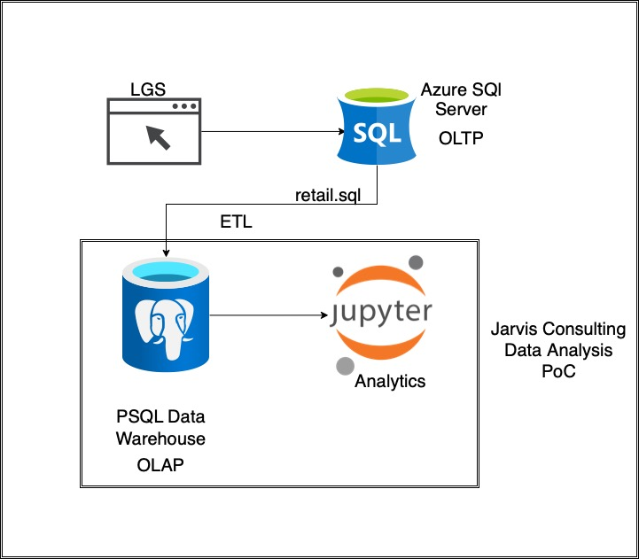

# Introduction

London-Gift-Shop has been running business for more than 10 years. Their revenue has not grown in recent years
they decided to get some analysis done to better understand their customers and improve their business revenue

They will have their customers categorized into different potential segments and adjust their marketing, approach and pricing strategy accordingly

LGS has provided us with the customer data after implementing ETL process for customer and business privacy and legal reason.
Jarvis will analyze the data and answer business questions for LGS

For this we have used python to modify data and perform calculations and plot graphs for better visual understanding.
To achieve this we have used
1. Git to track project progress
2. Jupyter Notebook
3. Python libraries to use pre-written functions
4. Matplot library to draw graphs
5. Pandas sql libraries to read sql tables/files

# Implementation

LGS has their online RDBMS on azure. Since it is a PoC, Jarvis is not allowed to work directly work on azure
so LGS has given us their Datawarehouse access in form of a file that we can load and analyze using python.

## Data Analytics and Wrangling

[Retail Data Analytics](./python_data_wrangling/retail_data_analytics_wrangling.ipynb)

[Customer Segmentation with RFM](./python_data_wrangling/customer-segmentation-with-rfm-score.ipynb)

3 segments selected for evaluation are "Can't Lose", "Hibernating" and "Champions".

Number of customers for segments:
Can't Lose = 71, Hibernating = 1522, Champions = 852

### Can't Lose Segment;

        - The last shopping date of the customers is on average 353 days before.
        - Customers have made an average of 16 purchases.
        - Customers spent an average of £ 8356.

### Hibernating Segment;

        - The last shopping date of the customers is 481 days before average.
        - Customers made an average of 1 purchases.
        - Customers spent an average of £ 438.

### Champions Segment;

        - The last shopping date of the customers is 30 days before average.
        - Customers made an average of 19 purchases.
        - Customers spent an average of £ 10796.

### Can't Lose Segment;

        Customers in this segment have not recently made a purchase. For this reason, we need to prepare a discount and gift campaign for this segment. These customers made a large number of purchases when they made purchases before. However, recency values are lower than they should be. The campaign to be implemented for these customers should include both items purchased and recommendations based on previous activities. New and popular products associated with the products that they were interested in can also be included in this campaign. Situations that will cause these customers to stop buying need to be investigated.

### Hibernating Segment;

        Customers in this segment have not made a purchase for a long time. However, by offering discounts, they may be attracted to another purchase.
### Champions Segment;

        Customers in this segment are responsible for most of the revenue. Campaigns should be implemented to ensure the continuity of the shopping of these customers.- Discuss how would you use the data to help LGS to increase their revenue (e.g. design a new marketing strategy with data you provided)

# Improvements
Three improvements that can be made if we had more time

- Try to find if there is any relation between prices of items and customer expenditure
- Try to find which most and least sold items and devise strategy accordingly
- Try to categorize customers based on type of items sold and time of year to reduce stock storage and management costs